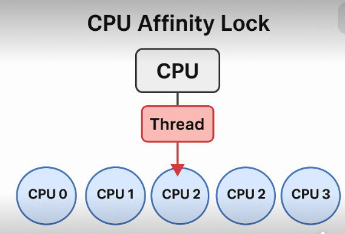

# cpu亲和锁

引入依赖
```shell
<dependency>
    <groupId>net.openhft</groupId>
    <artifactId>affinity</artifactId>
    <version>3.0.6</version>
</dependency>
```
示例
```java
import net.openhft.affinity.Affinity;

public class AffinityExample {
    public static void main(String[] args) {
        // 锁定到 CPU 0
        Affinity.setAffinity(1L << 0);
        System.out.println("Thread pinned to CPU 0");

        while (true) {
            // 模拟任务
        }
    }
}
```

注意:
- Affinity 设置必须在启动线程后设置，否则无效
- CPU 亲和性可以用于提升缓存命中率、减少上下文切换。
- 如果是线程池，建议在创建线程时绑定 CPU


# 一、什么是 CPU 亲和性（CPU Affinity）？
CPU 亲和性 是操作系统提供的一种机制，用于控制一个线程或进程只能运行在指定的一个或多个 CPU 核心上。
这就像告诉系统：“这个线程只能跑在 CPU 2 或 CPU 3 上，其他 CPU 别插手。”

# 二、CPU 亲和锁的核心原理
1. 背景：线程调度和迁移
   现代操作系统的线程调度器是“负载均衡”的，它会动态将线程在多个 CPU 核心之间迁移，以提升整体系统吞吐。
   但线程迁移带来两个问题：
    - 缓存失效（Cache Miss）：
      - 每个 CPU 有自己的 L1/L2/L3 缓存，线程在 A 核心运行时，缓存了很多数据；突然被迁移到 B 核心，就不得不重新加载数据 → 导致性能下降。
    - 上下文切换开销：
      - 尤其在高并发场景下，频繁切换线程会造成额外开销。
2. 原理本质：通过设置 CPU 位图，固定运行核心
   在 Linux 系统中，进程/线程的运行核心通过 CPU mask（位图）表示：
   ```text
   CPU mask: 00001000 → 表示只能运行在 CPU 3 上
   ```
   系统提供的底层调用：
   ```shell
   int sched_setaffinity(pid_t pid, size_t cpusetsize, const cpu_set_t *mask);
   ```
   - pid：进程 ID，0 表示当前线程
   - mask：表示允许运行在哪些 CPU 上 
   - 设置之后，内核调度器就只能在指定 CPU 范围中分配该线程
💻 示例：
设线程亲和性为 CPU 2，那么操作系统的调度器就只会在 CPU 2 上安排这个线程运行，不会迁移到其他核。
# 三、为什么能提升性能？
| 优化点             | 描述                                                                 |
|------------------|----------------------------------------------------------------------|
| 缓存命中率提升     | 线程总在同一个核心运行，数据保留在该核心的 L1/L2 缓存中，不用频繁重建缓存 |
| 减少线程迁移开销   | OS 不再频繁迁移线程，避免上下文切换                                     |
| 降低抖动和延迟     | 在低延迟系统中（如交易系统、实时音视频）尤其关键                        |
| 线程之间干扰更少   | 不同线程绑定不同 CPU，减少争用与切换时间                               |

| 中文  |  英文   |
|:---:|:-----:|
| 你好  | hello |

# 四、应用场景
- 高频交易系统（HFT） 
- 实时音视频处理 
- 游戏引擎 
- 嵌入式/IoT 系统中的任务调度 
- JVM 高性能服务中的线程优化（比如 Netty、Disruptor）

# 五、风险与注意点
| 问题 |                       原因                       |
|:---:|:---:|
|❗ CPU 不均衡 |             如果绑定不合理，可能有的核很忙，有的核闲着              |
|❗ 难以调试 |               多线程调度行为更“固定”，可调性变差               |
|❗ 和线程池冲突 | 和 ForkJoinPool、线程池可能不兼容，需要配合 ThreadFactory 控制  |



怎么配置呢？
# 一、云服务器使用 CPU 亲和锁的 限制
🚫 1. 无法控制物理 CPU 核心
云服务提供商（如 AWS、阿里云、腾讯云）将物理机虚拟成多个租户实例。
你拿到的是 vCPU（虚拟 CPU），它可能会在物理机中不断迁移。
所以你设置的 CPU 亲和性，只能在 虚拟核范围内生效，不一定映射到同一个物理核。
🚫 2. 存在 vCPU 抢占/漂移
云环境中有可能多个实例共享一个物理 CPU，存在资源抢占、噪声邻居（noisy neighbor）问题。
即使你绑定了 vCPU 0，云平台也可能在后台迁移到物理 CPU 8。
🚫 3. 超线程无法关闭
你无法控制云服务的 BIOS 设置，像 HT、C-state 关闭、NUMA 等都无法配合亲和优化。

# 二、云上如何“模拟”亲和锁优化？
虽然不能完全控制 CPU，但可以尽量模拟亲和锁的优化思想：
✅ 1. 选择 专属型实例 或 裸金属实例
实例类型	特点	推荐用途
通用共享型（如 AWS t4g）	性能波动大	❌ 不适合高频交易
计算增强型（如 c7、c6i）	较稳定，性价比高	✅ 中等级别延迟
专属型实例（dedicated host）	一整个物理机只给你	✅ 高性能交易首选
裸金属实例（bare metal）	无虚拟化层，完全控制物理机	✅✅ 最接近物理机性能
👉 例如：
- 阿里云：ecs.g7e.large（专属型）
- AWS：metal 系列（c6gn.metal）
- 腾讯云：SA3、SN3ne裸金属服务器

调整 JVM + OS 优化项
JVM 绑定线程亲和性（Affinity.setAffinity()）
设置 isolcpus 和 nohz_full，将关键线程独占某些 vCPU
关闭 Linux C-State，使用 Performance governor 模式
开启 RPS/XPS 调整网卡收发包核心，配合 NUMA 优化

# 三、适合云上的高频交易优化路径
优化维度	云上替代策略
CPU 亲和	用 taskset 固定 vCPU + 使用专属/裸金属实例
Cache 命中	使用 Disruptor 等无锁队列，尽量数据局部化
网络优化	配置 DPDK 网卡或开启 SR-IOV、RDMA（部分云平台支持）
系统延迟	使用 clocksource=tsc, 禁用 C-state, 固定主频
噪声隔离	使用 dedicated host 或 bare metal 避免邻居干扰
